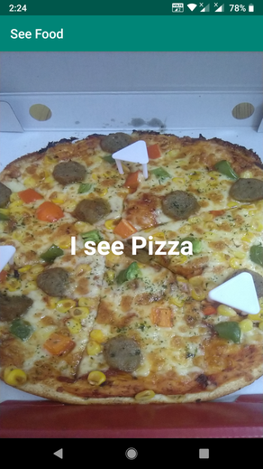

# SeeFood

A demo app made using AutoML Vision Edge by Firebase ML Kit. You need to connect with Firebase and upload your own training data to use the app properly.

## Blog link
[Firebase ML Kit: AutoML Vision Edge](https://proandroiddev.com/firebase-ml-kit-automl-vision-edge-62416d4575cc) 

## Screenshot

